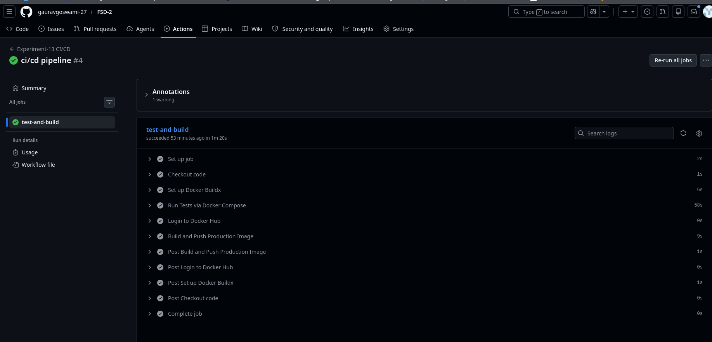
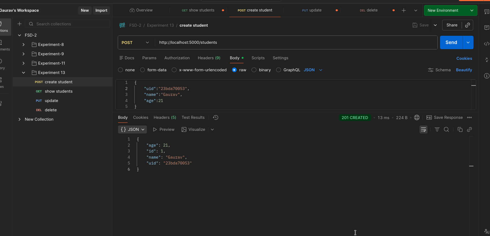
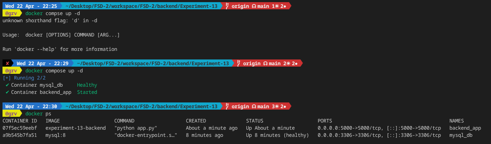
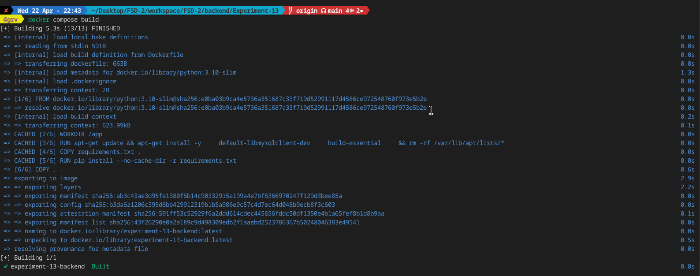

1. Aim

The aim of this experiment is to add a Continuous Deployment (CD) pipeline to the existing Testing framework (Experiment-16), create a production-ready Docker image for the backend application, and automate the deployment process using GitHub Actions.

2. Theory
Continuous Integration & Continuous Deployment (CI/CD)

CI/CD is a modern approach used in software development to deliver applications faster and more reliably by automating different stages of development.

Continuous Integration (CI):
In CI, developers regularly merge their code changes into a shared repository. Automated tests are run to make sure that the new changes do not break the existing system.

Continuous Deployment (CD):
CD takes things a step further. Once the code passes all tests, it is automatically built and deployed. In this case, a Docker image is created and pushed to a registry.

Why Docker is Used in CI/CD

Docker is commonly used in CI/CD pipelines because it helps maintain consistency across different environments.

Platform Independence:
Docker packages the application along with all its dependencies, so it can run on any system without worrying about the underlying OS.
No Configuration Issues:
Traditionally, systems needed to be set up manually (like installing Python or database drivers). With Docker, everything is already included in the image, so it avoids issues like “it works on my machine.”
Isolation:
Each process runs in its own container, ensuring that one process does not affect another. This also makes testing more reliable.
3. Project Structure
backend/Experiment-13/
├── app.py
├── requirements.txt
├── tests/
├── Dockerfile
├── docker-compose.yml
└── .github/workflows/
4. Implementation Details
Docker Configuration

The docker-compose.yml file is used to manage both the Flask backend and the MySQL database. In the CI setup, the depends_on feature with a health check ensures that the database starts properly before running the tests.

GitHub Actions Workflow

The workflow is triggered whenever code is pushed to the main branch. It has two main stages:

Test Phase:
Runs the command docker compose run --rm backend pytest. This creates a temporary container, runs the tests, and then stops automatically.
Deployment Phase:
After successful testing, a new Docker image is built and pushed to Docker Hub using GitHub Actions.
5. How to Run
Local Development

To run the application locally:

docker compose up --build
Running Tests

To run tests (similar to CI):

docker compose run --rm backend pytest
6. Learning Outcomes
Learned how to automate workflows using GitHub Actions
Understood how Docker ensures the same environment in development and production
Gained experience in running containers specifically for testing
Learned how to manage secrets securely in CI/CD pipelines
Understood how to make applications platform-independent

7. Screenshots 

GitHub Actions 

PostMan testing 

Docker - creating and checking running containers

Docker - building images

